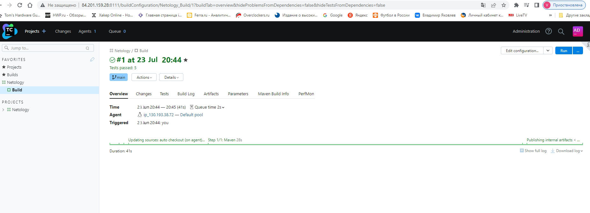

# Домашнее задание к занятию "09.05 Teamcity" dev-17_09.05-Teamcity-yakovlev_vs
Teamcity

## Подготовка к выполнению

1. В Yandex Cloud создайте новый инстанс (4CPU4RAM) на основе образа jetbrains/teamcity-server.
2. Дождитесь запуска teamcity, выполните первоначальную настройку.
3. Создайте ещё один инстанс (2CPU4RAM) на основе образа jetbrains/teamcity-agent. Пропишите к нему переменную окружения SERVER_URL: "http://<teamcity_url>:8111".
4. Авторизуйте агент.
5. Сделайте fork [репозитория](https://github.com/aragastmatb/example-teamcity) 
6. Создать VM (2CPU4RAM) и запустить [playbook](https://github.com/netology-code/mnt-homeworks/blob/MNT-video/09-ci-05-teamcity/infrastructure)


## Основная часть

#### Решение

1. Создайте новый проект в teamcity на основе fork.

Создан новый проект - Netology

2. Сделайте autodetect конфигурации.

сделано

3. Сохраните необходимые шаги, запустите первую сборку master.

Запустил. Прошло успешно


4. Поменяйте условия сборки: если сборка по ветке master, то должен происходит `mvn clean deploy`, иначе `mvn clean test`.


5. Для deploy будет необходимо загрузить [settings.xml](./teamcity/settings.xml) в набор конфигураций maven у teamcity, предварительно записав туда креды для подключения к nexus.


6. В pom.xml необходимо поменять ссылки на репозиторий и nexus.


7. Запустите сборку по master, убедитесь, что всё прошло успешно и артефакт появился в nexus.


8. Мигрируйте `build configuration` в репозиторий.


9. Создайте отдельную ветку `feature/add_reply` в репозитории.

```bash
$ git switch -c feature/add_reply
Switched to a new branch 'feature/add_reply'
```

10. Напишите новый метод для класса Welcomer: метод должен возвращать произвольную реплику, содержащую слово `hunter`

```bash
    public String sayHunter() {
        return "When the first hunter succumbed to the curse of blood, nightmare filled the streets of Kirova.";
    }
```

11. Дополните тест для нового метода на поиск слова `hunter` в новой реплике

```bash
	@Test
    public void netologySaysHunter() {
        assertThat(welcomer.sayHunter(), containsString("hunter"));
    }
```

12. Сделайте push всех изменений в новую ветку репозитория.


13. Убедитесь, что сборка самостоятельно запустилась, тесты прошли успешно.


14. Внесите изменения из произвольной ветки `feature/add_reply` в `master` через `Merge`

- есть

15. Убедитесь, что нет собранного артефакта в сборке по ветке `master`


16. Настройте конфигурацию так, чтобы она собирала `.jar` в артефакты сборки.


17. Проведите повторную сборку мастера, убедитесь, что сбора прошла успешно и артефакты собраны.


18. Проверьте, что конфигурация в репозитории содержит все настройки конфигурации из teamcity.

- есть

19. В ответе пришлите ссылку на репозиторий.

[Репозиторий example-teamcity](https://github.com/koshnv/example-teamcity.git)

---